# Cartrobot

## Descripció general

El projecte «Cartrobot» és la construcció amb cartró i l'electrònica necessària d'un robot capaç de caminar i que estiga controlat per bluetooth. Està basat en models publicats en internet i de codi lliure.

## Material

### Electrònica

|                                                        | Material                 |                                                        | Material                |
| ------------------------------------------------------ | ------------------------ | ------------------------------------------------------ | ----------------------- |
| 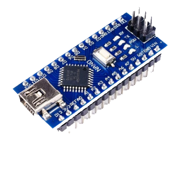   | 1x Arduino nano          | 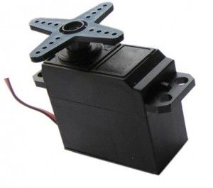     | 4x Servomotors          |
| 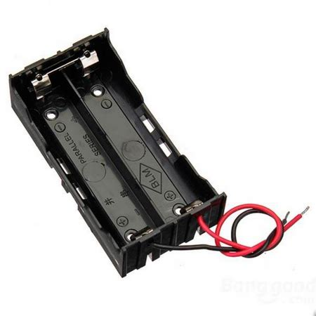 | 1x Portabateries 2x18650 | 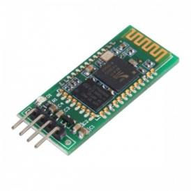 | 1x Modul bluetooth HC06 |
| 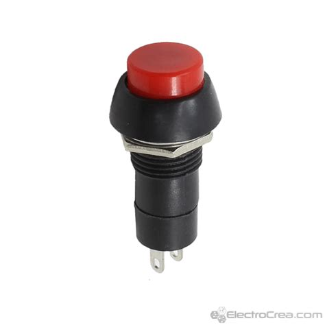    | 1x Interruptor           |                                                        |                         |

### Xassis

El muntatge consta de sis peces que li donen la seua forma característica i serveixen per suportar l'electrònica. Aquests ítems són:

- Cap superior
- Cap inferior
- 2 x Cames
- Peu dret
- Peu esquerre

Els plànols de les parts són:

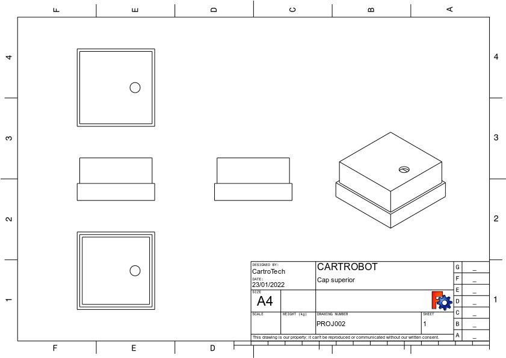{width="7.999cm" height="5.66cm"}

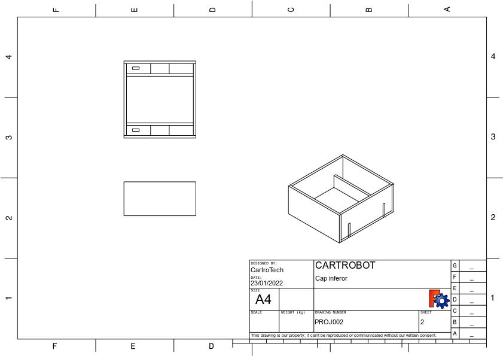{width="7.999cm" height="5.66cm"}

{width="7.999cm" height="5.66cm"}

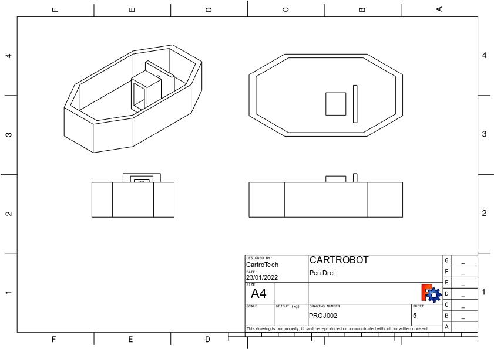{width="7.999cm" height="5.66cm"}

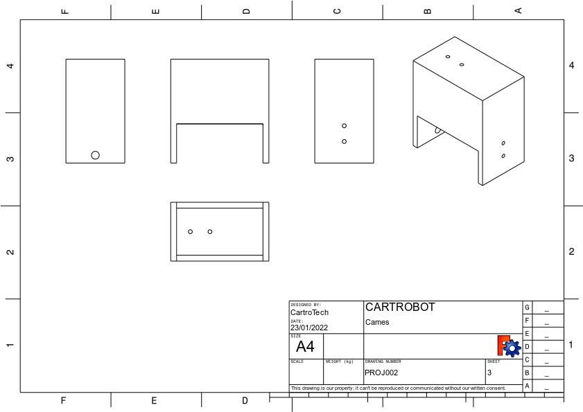{width="7.999cm" height="5.66cm"}

## Muntatge

El cap superior té un orifici per allotjar l'interruptor i un sortint per encaixar amb el cap inferior. Aquest té tres seccions, la central permet introduir el porta-bateries mentre les dues laterals suporten dos servos per accionar les cames.

Als peus es munten els altres dos servos. Fixeu-se que hi ha un peu per cada costat, és necessari per aconseguir l'equilibri del robot quan camine.

Les cames son idèntiques. En primer lloc hi ha que fixar-les als servos del cap i després als dels peus.

L'arduino nano i el mòdul bluetooth queden ocults a l'interior del cap superior.

## Funcionament

La seqüència de moviments per avançar un pas queda reflectida en la següent galeria d'imatges.

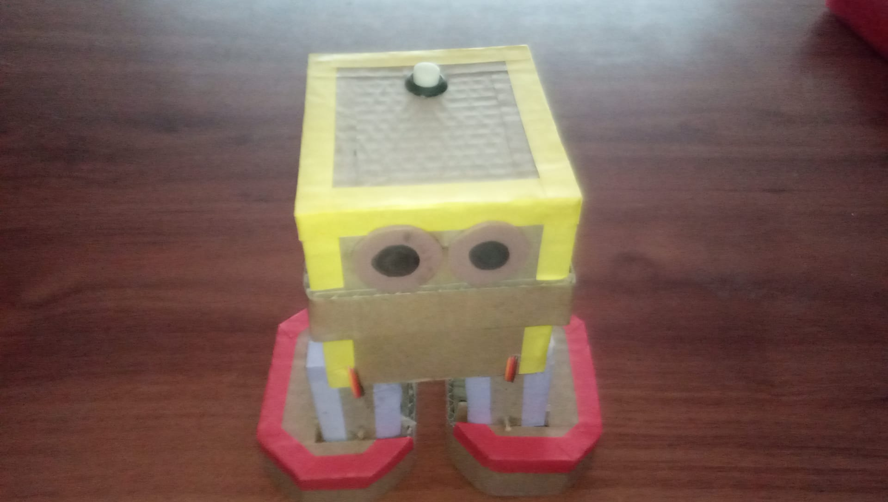
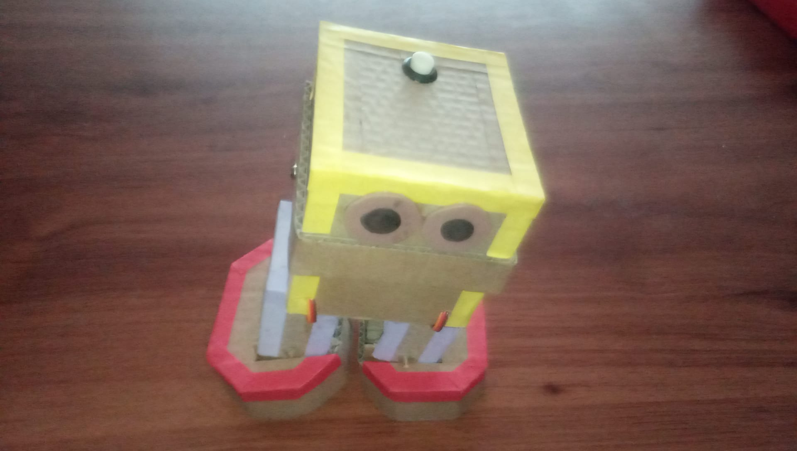
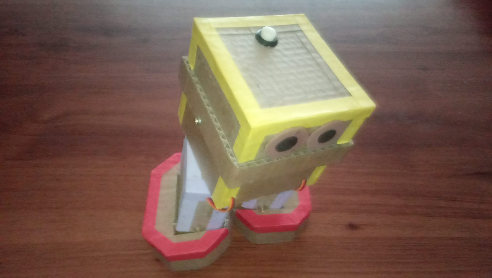
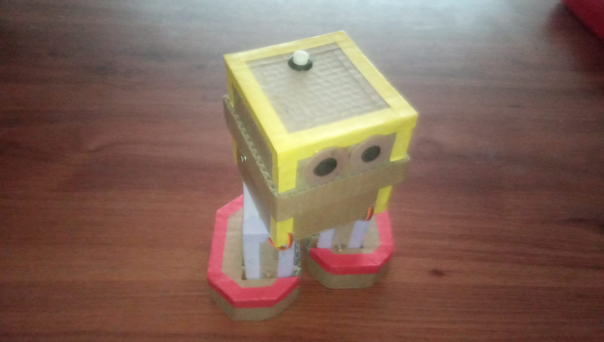
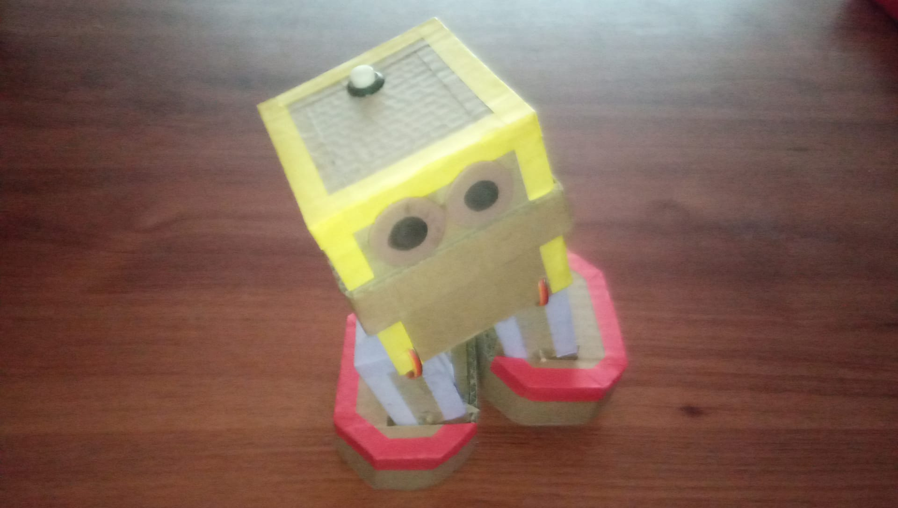

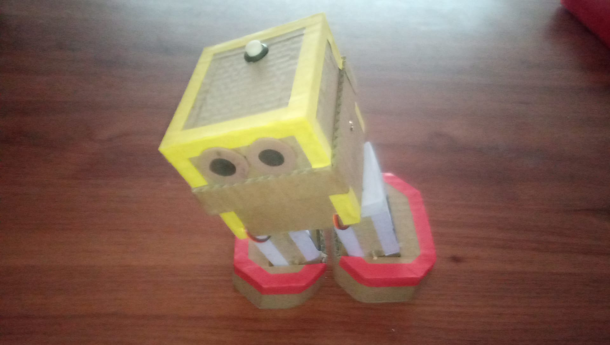
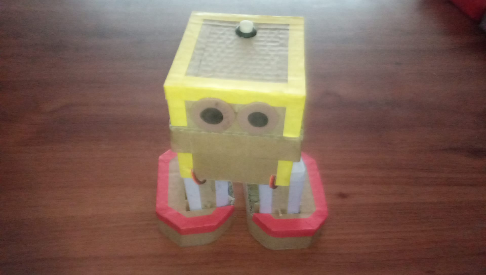
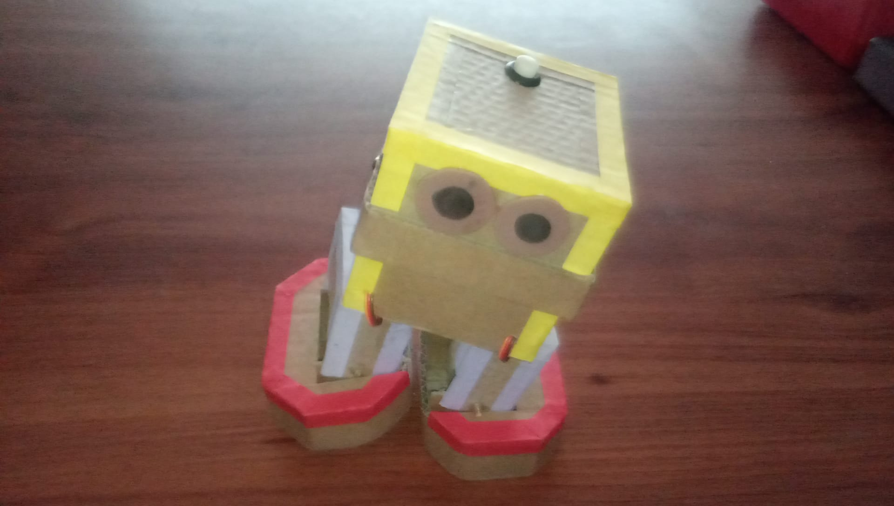
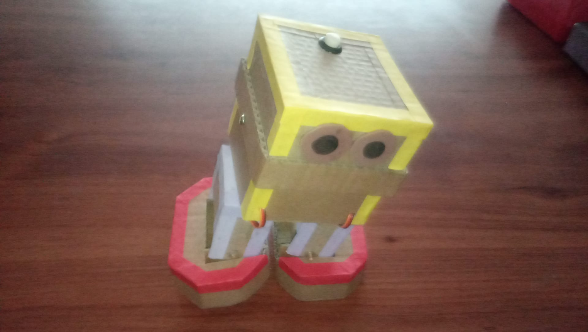

Hi han huit moviments bàsics:

- Alça el peu dret
- Baixa el peu dret
- Alça el peu esquerre
- Baixa el peu esquerre
- Avança la cama dreta
- Centra la cama dreta
- Avança la cama esquerra
- Centra la cama esquerra

Que ordenats, per aconseguir l'avanç del robot, queden de la següent manera:

1. Posició de repòs
2. Alça el peu dret
3. Avança la cama dreta
4. Baixa el peu dret
5. Alça el peu esquerre
6. Centra la cama dreta
7. Avança la cama dreta
8. Baixa el peu esquerre
9. Alça el peu dret
10. Centra la cama dreta

Amb els servomotors dels peus controlem la inclinació del robot i podem realitzar els moviments de alçar i baixar els peus. Amb el parell de servomotors del cap dirigim el balanceig de maluc i duem a terme els moviments de avançar i centrar les cames.

## Connexió

Esquema elèctric del muntatge:

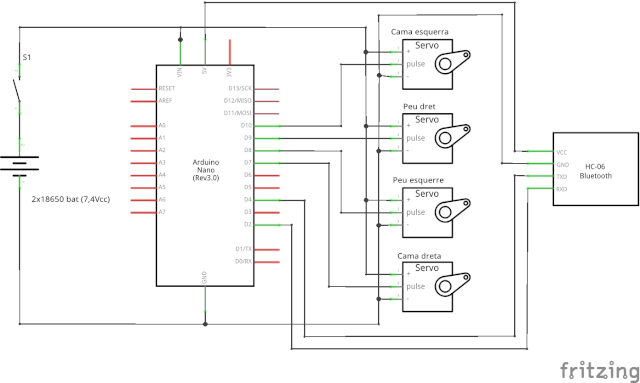

## Programació

El codi per fer funcionar el muntatge el podeu baixar en la secció de descàrrega al final del document. Per facilitar la lectura i el manteniment s'ha separat en tres pestanyes en el IDE arduino, per tant, dins la carpeta hi haurà tres arxius (Cartrobot.ino, FuncionBasiquesServo.ino, FuncionsMoviment.ino).

## Descàrrega

- [Codi Cartrobot](https://mega.nz/folder/XPgzgQQB#8zGO1x5W-CO9v48T1ukWDA)
- [Plànols del xassis](https://mega.nz/folder/bbpXXarL#CC5LdKII-LVYD78Uts72hg)
- [Full dades servo SG90](https://mega.nz/file/mCpXWCIZ#B0CpB3DT5lfwrNSPzerTLTvBUxRJXQ1IMhyIixlSTcU)

## Vídeo

<https://youtu.be/GeEv1hTTjmI>
